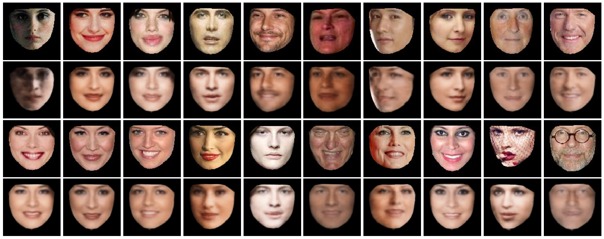
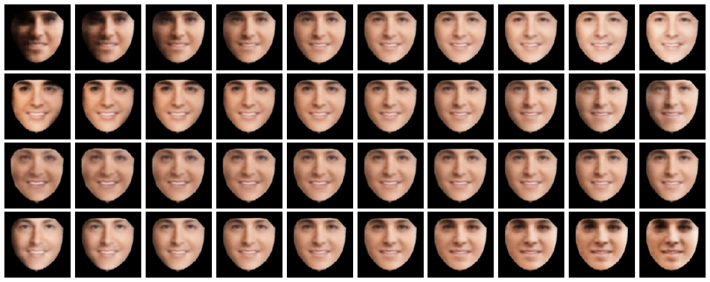
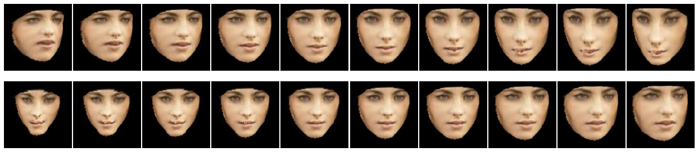
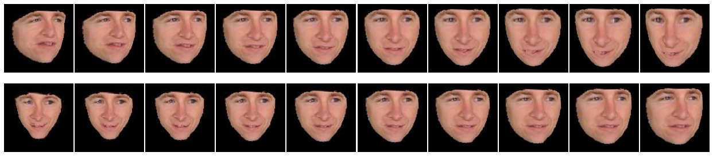

# Autoencoder

This is a simple implementation of an auto-encoder that I did as a part of class project to reduce the dimensionality of facial images. Auto-encoder is a neural network that encodes an image non-linearly into a latent vector. We can then change these latent vectors to produce modifications in faces.

The structure of the auto-encoder is:

## Dataset

The dataset was provided in the course and had 1000 faces of which 800 were used for training and 200 for testing.

## Results

Below are some of the reconstructed faces. The first and third row shows original image and second and fourth show the corresponding reconstructed faces:

If we interpolate the latent variables that have the maximum variance across the training set we see that the faces can be modified. Below are interpolations in appearance auto-encoder:

Below are interpolations in geometry auto-encoder:

