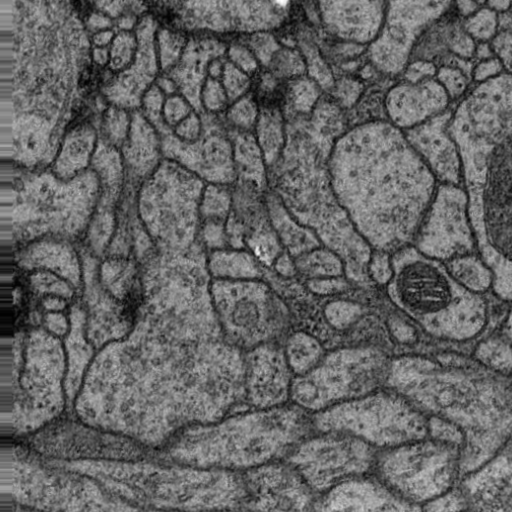
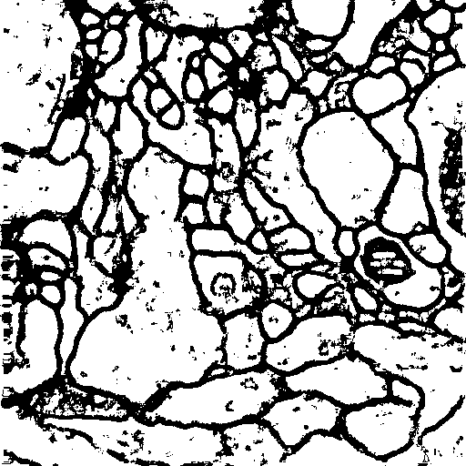
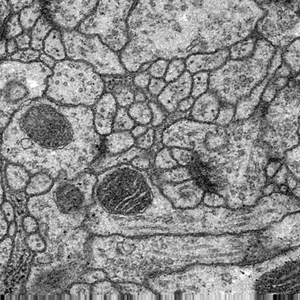
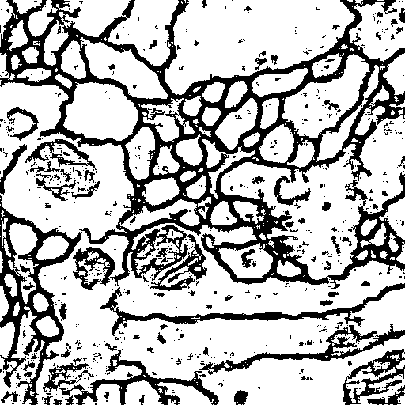
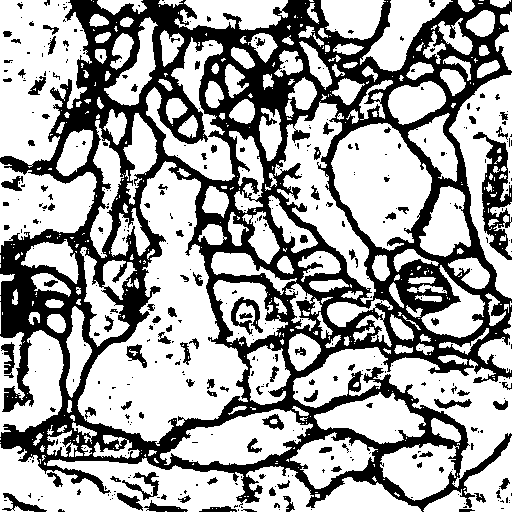

# U-net: Image segmentation

This is an implementation of the U-net architecture that was proposed in this [paper](https://arxiv.org/abs/1505.04597) in Tensorflow. This is a very basic and go to structure to perform image segmentation. The name U-net arises because of the shape of the structure. This structured differed from the existing "fully convolutional network" due to the presence of the upsampling path that increases the resolution of the output. Also skip connections are added in the contracting path and expanding path to merge spatial and semantic information.

## Dataset

The dataset is from the [isbi](http://brainiac2.mit.edu/isbi_challenge/) challenge. Extensive data augmentation was performed to train the network. The original dataset has only 30 training images and were augmented to form a dataset of 330 images using cropping, rotating and scaling. I used the keras ImageDataGenerator module to perform data augmentation.

## Results

I found that the training converged only for very small learning rate and loss function exploded otherwise. It should be noted that batch normalization and dropout were not used.

